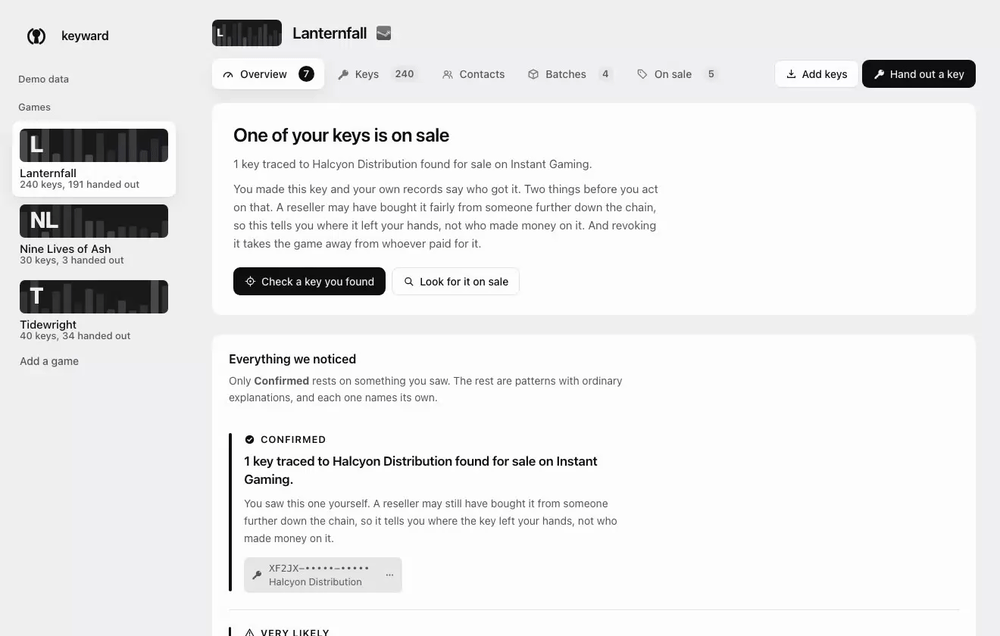
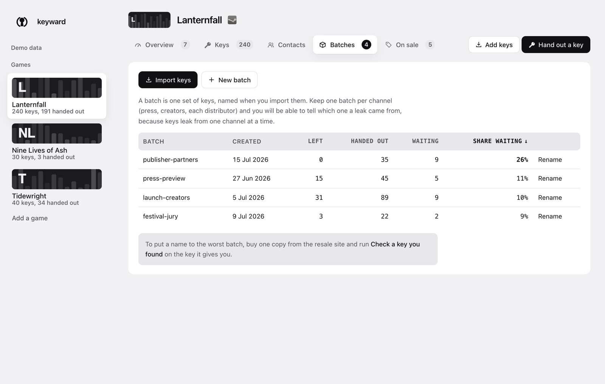
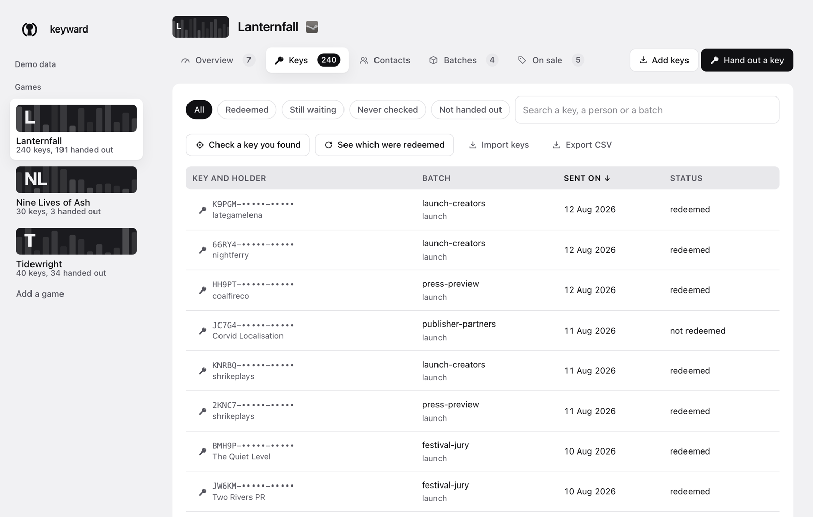
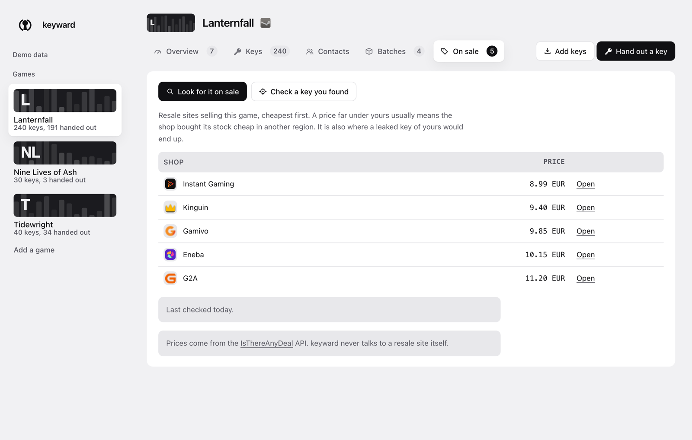

<div align="center">


# keyward

**Know which review key went to whom, and find out when one turns up for sale.**

A local-first tool for game studios. Everything runs on your own machine, and
nothing leaves it unless you ask.

[](LICENSE)
[](package.json)
[](package.json)
[](test)
[](https://github.com/jmbarrancoml/keyward/actions/workflows/ci.yml)

</div>

<picture>
  <source media="(prefers-color-scheme: dark)" srcset="assets/shots/overview-dark.png" />
  
</picture>

---

## The problem

You hand out hundreds of free keys to press and creators. They go out over email,
Discord, a spreadsheet, whatever. Weeks later your game shows up on a resale
site at a third of the price, and you have no way to tell which of the two
hundred people you trusted sold it.

Most studios answer that with an angry tweet. keyward answers it with a record:
which key went to whom, which ones Steam says were redeemed, and where the game
is selling that you did not put it.

## The move it is built around

A resale listing never shows you the key. It will sell you one for the price of
your own game, though, and you generated that key yourself, so once you are
holding it your own records can identify it.

<div align="center">
  
</div>

Your records give you the person, the batch it came from, and the day it went
out.

## Install

Node 24 or newer. No native modules, no build toolchain: the database is Node's
own SQLite and the runtime dependency list is empty, which matters for a tool
you hand a Steamworks session cookie to.

```sh
git clone https://github.com/jmbarrancoml/keyward && cd keyward
npm install && npm run build
npm link                      # puts `keyward` on your PATH
```

## Try it without a Steamworks account

```sh
npm run demo
```

Three invented games in three states: one mid-leak, one healthy, one just
registered. Every name, key, price and date is made up, the seed is fixed, and
it writes to its own file that can never touch a real key ledger.

## How it works

### Batches are channels

A batch is one set of keys, named as you import them. Keep one per channel
(press, creators, each distributor), because when keys start leaking they leak
from **one** channel at a time, and that is what lets keyward point at it.

<picture>
  <source media="(prefers-color-scheme: dark)" srcset="assets/shots/batches-dark.png" />
  
</picture>

### Every key is on the record

Keys are shown masked, because this tool gets opened on shared screens and in
calls. Click one to copy it in full; its menu traces it, records where you found
it, or opens it in Steamworks.

<picture>
  <source media="(prefers-color-scheme: dark)" srcset="assets/shots/keys-dark.png" />
  
</picture>

### Handing out a whole list

Assigning one key at a time matches nothing anybody does. Paste the list you were
going to mail anyway and you get a key against each name, ready for a mail merge.

```sh
keyward handout --game Lanternfall --batch press --file journalists.csv > send.csv
```

The record of who got what is written as a side effect, which is the only way it
ever stays up to date. There is a button for it in the Contacts tab. If the list
is longer than the batch, nothing is handed out at all: a half-sent campaign you
cannot tell apart is worse than an error.

Two more that fall out of keeping the record:

```sh
keyward remind --game Lanternfall     # who to chase, with their email
keyward unused                        # keys generated and never given to anyone
```

`remind` counts only keys you checked. Chasing someone over a key you never
looked up is how a studio accuses a journalist who redeemed it on day one.
`unused` is the stock sitting in a text file on somebody's desktop, which is
where `unassigned-activated` findings come from.

### What the rules look for

| Rule | How sure | Fires when |
| --- | --- | --- |
| `confirmed-on-sale` | Confirmed | You found a key for sale and recorded it |
| `region-mismatch` | Confirmed | A key from a region-locked batch turned up on sale elsewhere |
| `unassigned-activated` | Very likely | Keys came back redeemed that you never gave anyone |
| `dormant-cluster` | Very likely | One contact is holding several keys they never redeemed |
| `never-redeems` | Worth a look | Someone has taken several keys and redeemed none |
| `batch-hotspot` | Worth a look | One batch has far more unredeemed keys than the rest |
| `oversupplied` | Background | One contact holds a large share of the keys |

Region locking is the one measure that limits price arbitrage, so it is worth
recording. Tell keyward which country Valve locked a package to, and note where
you bought a key back from:

```sh
keyward batch new --game Lanternfall --batch latam --region MX
keyward trace MMMMM-00001-ZZZZZ --seen-on Kinguin --country ES
```

Only the first two rest on something you saw. The rest are patterns with ordinary
explanations, and each one states its own alongside the finding. Every threshold
is yours to change:

```sh
keyward rules                            # what they are, and the current values
keyward config set --rule clusterMin=5   # what counts as odd depends on how you send
```

`unassigned-activated` catches people out. You never sent those keys to anyone,
so no contact leaked them, which leaves a key export, a shared spreadsheet, or
someone else on the team who can generate keys. It sends you looking at your own
operation, which is the part studios rarely audit.

### Where prices come from

<picture>
  <source media="(prefers-color-scheme: dark)" srcset="assets/shots/sale-dark.png" />
  
</picture>

The [IsThereAnyDeal](https://isthereanydeal.com) API, which already aggregates
50+ shops. keyward never contacts a resale site itself. Their terms ask that
anything using the API credits them, which the interface does under every price
table.

A free key takes a minute: create an account, verify the email, register an app
at [isthereanydeal.com/apps/my](https://isthereanydeal.com/apps/my/), then
`keyward config set --itad-key <key>`. The UI walks you through it the first
time you look for prices.

## Correcting things, and closing them off

A ledger you cannot correct becomes a pile. Games, contacts and batches can be
renamed, and renaming onto an existing one merges them, which is how you fix the
same distributor entered twice. Nothing holding keys can be deleted by accident.

```sh
keyward game rename --game "Lanterfall" --to "Lanternfall"
keyward contact rename --recipient "Halcion" --to "Halcyon Distribution"   # merges
keyward key revoke XF2JX-YYNNC-JQBWG --note "found on Instant Gaming"
keyward export --game Lanternfall > ledger.csv
```

`revoke` records that you revoked a key and gives you the Steamworks link to go
do it, since Valve publishes no API for it. The key stops counting as an open
question, which is what the tool was missing: it named a leak and then had no
way for you to say you had dealt with it.

`export` writes every key, who holds it, its batch, its status and where it was
found, as CSV to stdout. There is a button for it in the Keys tab too. A tool
whose argument is that your data stays yours has to hand it back on request.

## Getting your keys out of Steamworks

Valve does not hand you a CSV, which is the first thing that trips people up.

1. Open your game in [Steamworks](https://partner.steamgames.com) and click
   **Request Steam Product Keys**.
2. Ask for the number you need. Valve reviews anything over 5,000 by hand.
3. Download the batch. You get a **zip with a plain text file inside**.
4. Drop that zip straight into keyward. It reads the archive, and it finds keys
   in a CSV, a spreadsheet paste, a bulleted list or the middle of a forwarded
   email just as well.

**Only the person who made the request can download those keys.** If a colleague
asked for them, the download has to come from their account.

## Finding out without opening it

```sh
keyward watch --notify
```

It refreshes what it can, works out which findings are new since the last run,
and **exits 1 when something is**, so cron mails you the output and stays quiet
the rest of the time:

```
0 9 * * 1-5  cd /path/to/keyward && node dist/cli.js watch --limit 60 --notify
```

A finding is remembered by what it is about, so you are told once rather than
every morning, and again if it gets worse: a contact going from three unredeemed
keys to seven is a new fact.

Between those runs, no part of keyward is running.

<details>
<summary><b>Sending alerts to Slack or Discord</b></summary>

<br />

```sh
keyward config set --webhook https://hooks.slack.com/services/...
```

`watch` will POST new findings there. Both services render the `text` field, so
one shape covers them.

This is the one thing keyward does that sends your data off the machine. It is
off unless you set it, the URL is a secret worth treating like one, and what
goes out includes the names of your contacts.

</details>

## What it can and cannot tell you

**It can** say that a specific key went to a specific person, that it is still
unredeemed weeks later, and that the game is meanwhile selling on four resale
sites. Trace a key you bought and it names the recipient outright.

**It cannot** tell you that a given listing *is* one of your keys without buying
it. Nothing about a Steam key is visible in a shop listing, so short of that,
attribution is a shortlist. The report says so every time it runs, on purpose:
most unredeemed keys are a reviewer who never got round to it, and a studio that
publicly accuses the wrong person does more damage than the leak did.

**Steam will not tell you which account redeemed a key.** Valve's documentation
is silent, the public batch-query scripts have only ever read a status and a
date, and the community answer is a flat no on privacy grounds. Work around
that limit and you have built this tool: the only route from "this key was never
redeemed" to a person is the record you kept when you sent it.

## What else is out there

Plenty of tools touch this problem. None of them keeps a per-key record, so the
studio hunting a leak still does the join by hand.

| | What it is | Cost | Knows a key was redeemed | Finds it on sale | Names who you sent it to |
|---|---|---|---|---|---|
| [Keymailer](https://keymailer.co/), Lurkit, Terminals.io | Hands keys to creators and tracks whether they posted | $25 to $99 a month, Terminals from $2,000 a campaign | no | no | the creator who claimed it |
| [KeyRedeem](https://keyredeem.net/) | Distribution dashboard, private beta | free tier | no | no | who took one from the pool |
| [steamkeychecker.com](https://www.steamkeychecker.com/) | Chrome extension, bulk activation status | paid | yes | no | no |
| Steamworks Key Stats | Valve's own count of activated against unactivated | free | as a total | no | no |
| [Red Points](https://www.redpoints.com/gray-market/), Corsearch | Brand protection, takedowns across marketplaces | by quote | no | listings, not your keys | no |
| [IsThereAnyDeal](https://isthereanydeal.com/), GG.deals | Price comparison, built for buyers | free | no | prices, not your keys | no |
| **keyward** | A local ledger of every key you handed out | free, MIT | yes | yes | yes |

Woovit belonged in the first row until it shut down in December 2024, which is
the ordinary argument for keeping the record in a file you hold.

The advice studios get for tracing a leak is to buy their own game from a resale
site every few weeks and work out where that key came from
([GameDiscoverCo](https://newsletter.gamediscover.co/p/have-you-lost-track-of-steam-key)).
That is `keyward trace`, done by hand.

### The 649 keys

tinyBuild revoked 649 keys for *ReStory* in 2026 after finding most of them on
reseller sites. The sweep also hit people who had bought the game from Green Man
Gaming, and tinyBuild worked with the retailer to reissue those keys.

keyward revokes nothing; Valve's page does that. What it holds is the record
that tells you which batch a key came from before you click, so the batch you
sold to a retailer and the batch you sent to twelve journalists never look the
same on the way out.

### What it does not do

It finds no creators, runs no audience network, and hands out no keys for you.
The platforms above do that well. A studio can run both: theirs for reaching
people, this for what becomes of the key afterwards.

## Security

You are handing this thing a Steamworks session cookie and a ledger of
unredeemed keys, so it owes you specifics.

- **Everything is local.** The database is a SQLite file under
  `~/.config/keyward/`, written mode 0600 because SQLite would otherwise leave
  it readable by every account on the machine. `keyward encrypt` seals it if you
  want that too.
- **Five hosts, all listed.** Steamworks, IsThereAnyDeal, a shop's favicon,
  Steam's art CDN, and a webhook if you set one. No telemetry, no analytics, no
  update check.
- **The browser page contacts nothing.** It runs under
  `default-src 'none'`; shop logos and store art are fetched by the local server
  and stored as data, so the page never reaches out.
- **The UI binds to `127.0.0.1` only,** mints a token per run, pins the `Host`
  header against DNS rebinding, refuses cross-origin requests, and cannot be
  framed.
- **The Steamworks cookie lives in the OS keystore,** never in the database.
- **Zero runtime dependencies,** and CI fails the build if that ever changes.

[SECURITY.md](SECURITY.md) has the threat model, the full egress table, where
every secret is kept, and a section on what none of this protects you from.

<details>
<summary><b>Locking the web UI behind a password</b></summary>

<br />

```sh
keyward password set
```

scrypt, salted, with the session held in memory so quitting the server ends it.

It gates the browser and only the browser. Someone sitting at your unlocked
machine cannot read the ledger through the page, but the CLI still opens the
database without asking. For the file itself, see below.

</details>

<details>
<summary><b>Encrypting the database at rest</b></summary>

<br />

```sh
keyward encrypt
```

AES-256-GCM over the whole database, with the key wherever your platform keeps
secrets: the macOS keychain, Windows DPAPI, or libsecret on Linux. Every
command works exactly as before and nothing asks you for a password, because
`node:sqlite` can hand over the database as bytes and take it back the same way.
No new dependency, no separate SQLite build.

It closes the case where the file leaves your machine: a copied database, a
backup, a Time Machine snapshot, a folder synced to Dropbox or iCloud, a `.db`
attached to a support ticket. Whoever ends up with the file gets noise.

It closes nothing against something already running as your user, which can ask
the keychain for the key exactly the way keyward does, and nothing at all while
keyward is open, because the database is then decrypted in memory.

Three things change, which is why this is a choice and not the default:

- **Lose the key and the ledger is gone.** `keyward encrypt` prints a recovery
  code once. Write it down somewhere that is not the machine.
- **No more poking at the file.** No SQLite viewer, no `sqlite3` shell, no `.db`
  you can hand to someone else to look at.
- **Crash safety gets weaker.** SQLite's journal cannot protect a file it does
  not own, so keyward writes the whole sealed database after every change,
  through a temporary file and an atomic rename.
- **One at a time.** SQLite lets two processes share a plain file. A sealed one
  is held whole in memory, so keyward refuses to save over a file something else
  has written rather than erase it.

`keyward decrypt` reverses it. On a second machine, or after losing the store,
`keyward restore-key <code>` puts the key back.

</details>

## Status

Early. Covered by 166 tests: the data model, key extraction, the zip reader,
the rules and their thresholds, the report, the browse endpoints, CLI routing,
the UI server's security properties, encryption round-trips, and design
invariants that stop contrast
and type size from regressing.

**The Steamworks activation parser has never run against a live response.** It
was written against the page shape that public batch-query scripts have used for
years, and it returns `unknown` rather than guessing when the markup does not
match. Until someone with partner access validates it, treat `keyward check` as
unproven. [`test/fixtures/README.md`](test/fixtures/README.md) says exactly what
is needed: two anonymised `querycdkey` responses would close it.

## Platforms

Node 24 or newer, and CI runs the suite on all three.

| | macOS | Linux | Windows |
|---|---|---|---|
| Everything except the two rows below | yes | yes | yes |
| Where secrets go | login keychain | libsecret, if `secret-tool` is installed | DPAPI |
| Desktop notification from `watch` | Notification Centre | `notify-send` | tray balloon |

Without a keystore, `keyward auth set` and `keyward encrypt` refuse rather than
write a secret somewhere weak, and both tell you the environment variable to use
instead. On Debian and Ubuntu, `apt install libsecret-tools` is the whole fix.

One difference worth knowing: the database is written mode 0600 on macOS and
Linux. Windows has no such thing, so keyward rewrites the file's ACL with
`icacls` to leave only your account on it.

## Why I built this

The same post keeps going round. A small studio finds its own game on a resale
site at a third of the price, says so publicly, and adds that there is no way to
tell which of the keys they gave away ended up there. One of the studios saying
it had four people on it.

They are right that Steam will not tell them. Valve records that a key was
redeemed and says nothing about by whom, and that is a privacy decision, not an
oversight. But the answer was never Valve's to give. It is the list of who each
key went to, which the studio had all along and never wrote down, because writing
it down means a spreadsheet nobody updates by the third week of a launch.

So this writes it down, and makes the resale listing usable: buy your own game
back for a few euros and the key you get names the channel it left through.

I am not selling anything here. There is no account to make, no tier, no seat
price, and nothing about it phones home.

Open source for three reasons, in the order they matter to me.

**You have to be able to read what you are trusting.** This asks for a Steamworks
session cookie, which can act as your studio inside Valve's partner site, and it
holds the keys you have not handed out yet. Nobody should take that on trust from
a binary. It is 7,000 lines with no dependencies, and 4,000 more of tests you can
run yourself before you type anything real into it.

**The studios who need it most cannot buy the alternative.** Brand protection
firms price by quote and sell to companies with legal teams. Everyone below that
gets an angry tweet and a spreadsheet.

**A tool holding your key ledger should not be able to close.** Woovit did, in
December 2024. Fork this, keep the file, and nothing anyone else does can take it
from you.

I do not have Steamworks partner access, so the one piece that talks to Valve has
never run against a live response. That is the first thing on the contributing
page for a reason.

## Contributing

[CONTRIBUTING.md](CONTRIBUTING.md) has the house rules and what would help most.
The short version: real Steamworks fixtures, then keyshop classification,
console keys, and importers for Keymailer and the others.

```sh
npm test          # everything, offline
npm run dev:demo  # the UI against demo data, reloading as you save
npm run shots     # regenerate the screenshots in this file
```

## The mark

A warded keyhole. A *ward* is the obstruction inside a lock that blocks every
key but the right one, which is where the name comes from. The ring opens at top
and bottom so it frames the keyhole rather than enclosing it.

## License

MIT.
